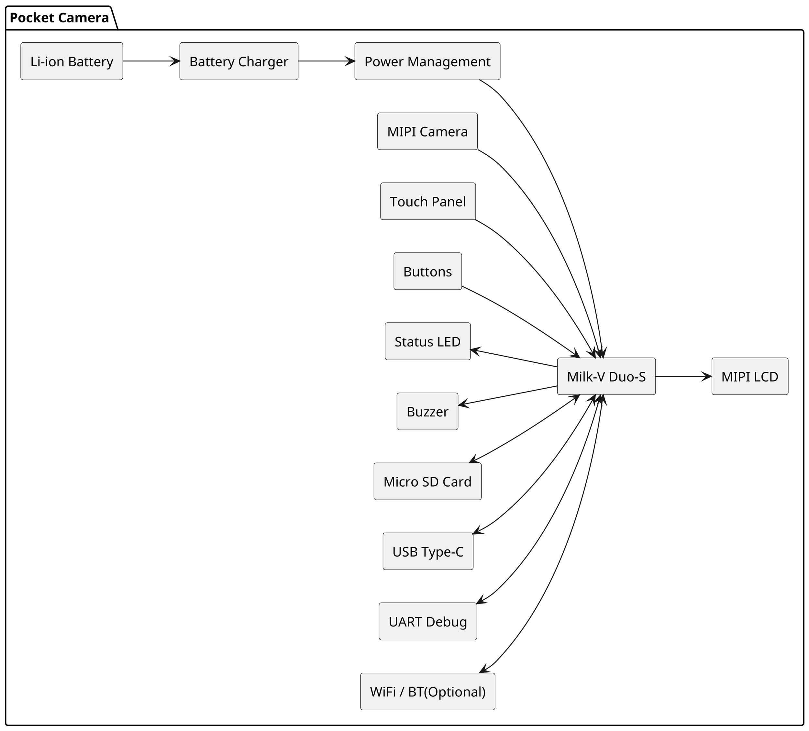

## 项目介绍

### 项目名称

Pocket - 基于 Milk-V Duo-S 的开源便携智能相机

### 项目简介

Pocket 是一款基于 Milk-V Duo-S 打造的开源便携式智能相机，集成摄像头、LCD 实时预览、按键交互、本地存储以及 Linux 图形界面，旨在探索嵌入式 Linux 在消费级影像设备中的完整应用。项目从底层驱动到应用层全部自主实现，既可作为学习嵌入式 Linux、Camera Pipeline 和 GUI 开发的实践案例，也可以作为二次开发的平台。

### 项目背景

便携易用的 Pocket、CCD、小型相机很受创作者的欢迎。

然而，对于嵌入式开发者而言，很少有一个项目能够完整覆盖：

* Camera 驱动
* ISP
* MIPI DSI 显示
* Linux GUI
* 输入设备
* 多媒体框架
* 文件管理
* 电源管理

因此，希望通过 Pocket 项目，将这些模块整合到一个真正可以使用的产品中。

### 项目目标

本项目希望实现：

* 实时相机预览
* 一键拍照
* 图片浏览
* 参数调节
* 视频录制
* 本地存储
* UI 菜单
* 可拆卸电池供电
* 后续 AI 功能扩展

### 项目特色

+ Linux 系统
+ Milk-V Duo-S 平台
+ Camera + ISP
+ MIPI LCD 实时显示
+ LVGL 图形界面
+ 多级菜单
+ 按键交互
+ JPEG 拍照
+ H.264 视频录制
+ USB 导出图片

## 项目照片

...待补充

## 功能演示GIF

...待补充

## 快速开始

### 硬件准备

项目需要的硬件如下：

| Component         | Description           |
| ----------------- | --------------------- |
| Development Board | Milk-V Duo-S          |
| Camera            | OV5647 / GC2083       |
| Display           | ST7701S MIPI LCD      |
| Storage           | Micro SD Card         |
| Power             | 5V USB-C Power Supply |

硬件连接：

```puml
skinparam dpi 300
Camera  –> Milk-V Duo-S  
LCD     –> MIPI DSI Interface
Power   –> USB-C 5V
```

### 准备开发环境

依赖：

- Linux host (推荐Ubuntu 22.04)
- RISC-V 交叉编译工具链
- Milk-V Duo SDK

克隆代码仓：

```bash
git clone https://github.com/y-Adrian/pocket.git
cd pocket
```

开发环境初始化：

```bash
source envsetup.sh
```

### 构建固件

构建完整的系统：

```bash
make
```

产物：

```bash
output/
├── boot.sd
├── rootfs.ext4
└── firmware.bin
```

### Flash Image

插入 SD 卡：

```bash
lsblk
```

Flash image:

```bash
sudo dd if=output/boot.sd of=/dev/sdX bs=4M status=progress
sync
```

将 SD 卡插入到 Milk-V Duo-S

### 启动 pocket

启动设备
通过串口登录（ssh也可）

```bash
picocom /dev/cu.usbserial-xxxx -b 115200
```

启动应用

```bash
cd /opt/pocket
./pocket_app
```

### 预期结果

启动之后：

- LCD 显示器显示摄像头预览
- 按钮能够控制菜单
- 摄像头捕捉能够工作
- 系统状态能够被展示

## 硬件组成


## 软件架构

[软件架构图](architecture/02-layer-design.md)

### 状态机
[状态机](architecture/05-state-machine.md)


## Roadmap

[Roadmap](ROADMAP.md)
