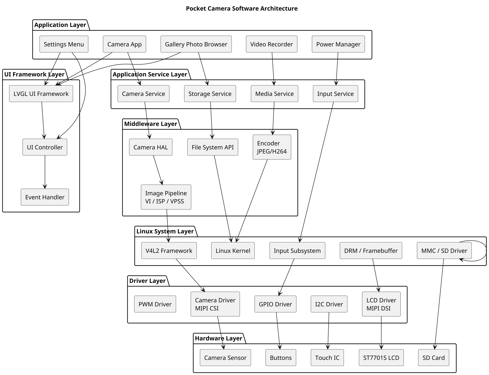

## layer design

### 软件架构图

```plantuml
@startuml Pocket Software Architecture 
skinparam dpi 300

skinparam componentStyle rectangle
skinparam defaultFontName Helvetica 
title Pocket Camera Software Architecture
package "Application Layer" {
    component "Camera App" as CameraApp
    component "Gallery Photo Browser" as Gallery
    component "Video Recorder" as Recorder
    component "Settings Menu" as Settings
    component "Power Manager" as PowerMgr
}
 
package "UI Framework Layer" {
    component "LVGL UI Framework" as LVGL
    component "UI Controller" as UIController
    component "Event Handler" as Event
}

package "Application Service Layer" {
    component "Camera Service" as CameraService
    component "Storage Service" as StorageService
    component "Media Service" as MediaService
    component "Input Service" as InputService
}

package "Middleware Layer" {
    component "Camera HAL" as HAL
    component "Image Pipeline\nVI / ISP / VPSS" as ISP
    component "Encoder\nJPEG/H264" as Encoder
    component "File System API" as FSAPI
}

package "Linux System Layer" {
    component "Linux Kernel" as Kernel
    component "V4L2 Framework" as V4L2
    component "DRM / Framebuffer" as Display
    component "Input Subsystem" as Input
    component "MMC / SD Driver" as SD
}

package "Driver Layer" {
    component "Camera Driver\nMIPI CSI" as CamDrv
    component "LCD Driver\nMIPI DSI" as LCDDrv
    component "GPIO Driver" as GPIO
    component "I2C Driver" as I2C
    component "PWM Driver" as PWM
}

package "Hardware Layer" {
    component "Camera Sensor" as Sensor
    component "ST7701S LCD" as LCD
    component "Touch IC" as Touch
    component "Buttons" as Buttons
    component "SD Card" as SDCard
}

CameraApp --> CameraService
Gallery --> StorageService
Recorder --> MediaService
Settings --> UIController
PowerMgr --> InputService

CameraApp --> LVGL
Gallery --> LVGL
Settings --> LVGL

LVGL --> UIController
UIController --> Event

CameraService --> HAL
MediaService --> Encoder
StorageService --> FSAPI
InputService --> Input

HAL --> ISP
ISP --> V4L2

Encoder --> Kernel
FSAPI --> Kernel

V4L2 --> CamDrv
Display --> LCDDrv
Input --> GPIO
SD --> SD

CamDrv --> Sensor
LCDDrv --> LCD
GPIO --> Buttons
I2C --> Touch
SD --> SDCard

@enduml
```