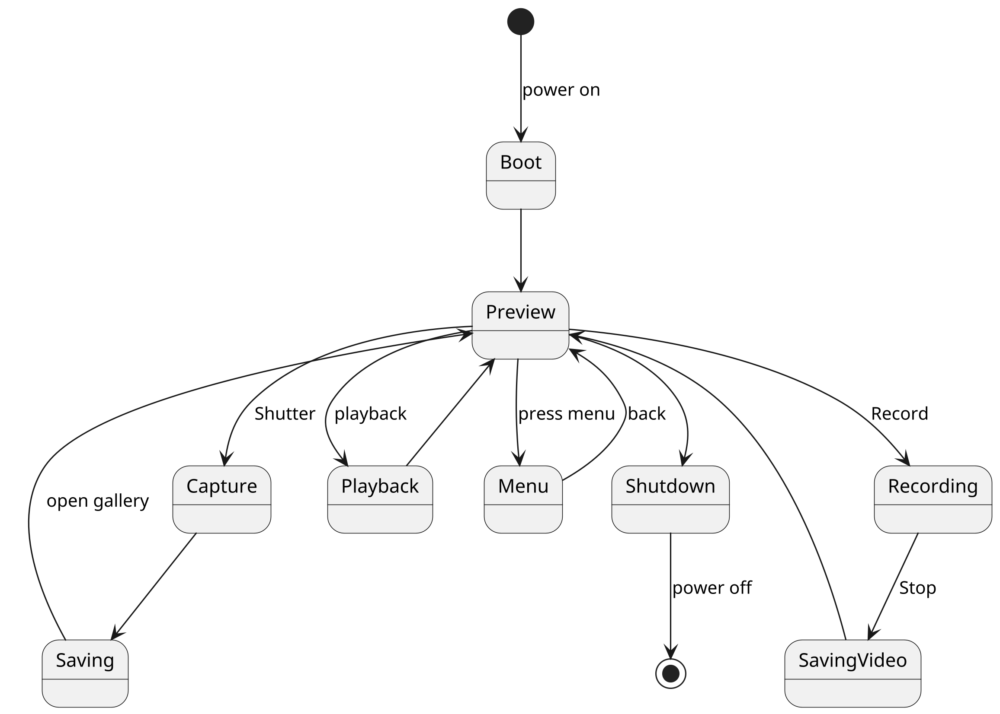

## 状态机

```puml
@startuml CameraState 
skinparam dpi 300

[*] --> Boot : power on
Boot --> Preview
Preview --> Capture : Shutter
Capture --> Saving 
Saving --> Preview : open gallery
Preview --> Recording : Record
Recording --> SavingVideo : Stop
SavingVideo --> Preview
Preview --> Playback : playback
Playback --> Preview
Preview --> Menu : press menu
Menu --> Preview : back
Preview --> Shutdown
Shutdown --> [*] : power off
@enduml
```

### 详细状态定义

| 状态  | 定义  |
| --- | --- |
|     |     |
