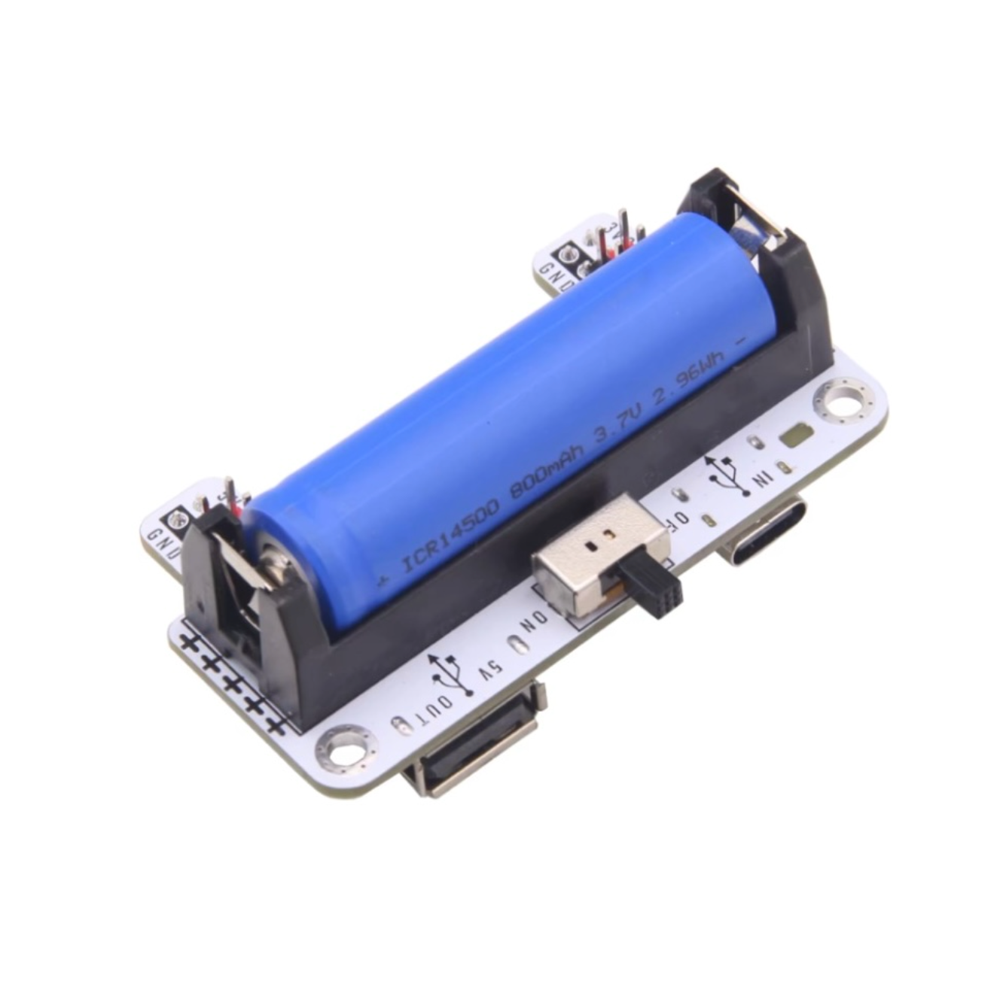

## battery

独立电源使用 5V/3.3V 锂电池和 IP5036 升压模块组成，支持 USB 电源输出

### 电池类型

5V/3.3V 锂电池

### 电池容量

1000mAh

### 充电方案

使用 USB-C 通过 IP5036 模块对锂电池充电。

### 电压转换方案

使用 IP5036 模块进行升压，将 3.7V 锂电池电源升压至 5V，给 milkv-duo-s 供电。

### 充电时长
电池从空到满，约需要充电 40min