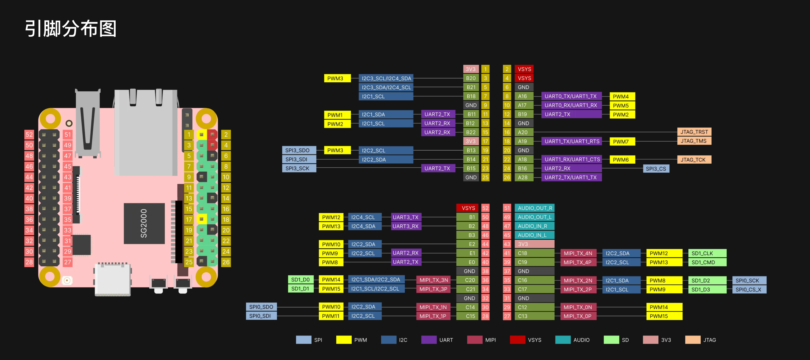

## 开发板
### 基本信息
Milk-V DuoS 是 Duo 的升级型号，升级了 SG2000 主控，拥有更大的内存（512MB）和更多的 IO 接口。 它集成了 WI-FI 6/BT 5 无线功能，并配备 USB 2.0 HOST 接口和 100Mbps 以太网端口，方便用户使用。 它支持双摄像头（2x MIPI CSI 2 通道）和 MIPI 视频输出（MIPI DSI 4 通道），可实现多种应用。 DuoS 还支持通过开关在 RISC-V 和 ARM 启动之间切换。

SG2000 是一款高性能、低功耗芯片，专为智能监控 IP 摄像机、本地面部识别考勤机、智能家居设备等各种产品领域而设计。 它集成了 H.264/H.265 视频压缩解码和 ISP 能力。 支持 HDR 宽动态、3D 降噪、去雾、镜头畸变校正等多种图像增强和校正算法，为客户提供专业级的视频图像质量。

该芯片还集成了内部 TPU，在 INT8 运算下可提供约 0.5TOPS 的计算能力。专门设计的 TPU 调度引擎高效地为张量处理单元核心提供高带宽数据流。

[SG2000 数据手册](https://github.com/milkv-duo/duo-files/blob/main/duo-s/datasheet/SG2000_Preliminary_Datasheet_V1.0-alpha_CN.pdf)

### 引脚图
milkv-duo-s 引脚图：

