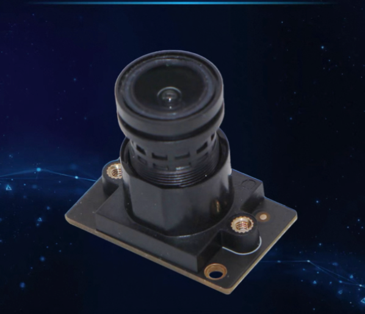
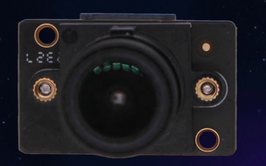
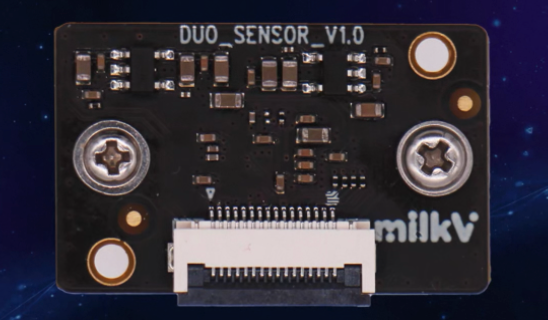

## Camera

### 基本信息

摄像头采用 milk-v CAM-GC2083 2MP 高清摄像头模组

CAM-GC2083 配备了 GLAXYCORE 的 GC2083 CMOS 图像传感器，分辨率高达 200 万像素，与 Milk-V Duo 板上的16P MIPI CSI接口兼容。

### 传感器特性 Sensor Fectures

+ Optical size: 1/3 inch
+ Pixel size: 2.7µm×2.7µm FSI
+ Active image size: 1920 x 1080
+ Color Filter: RGB Bayer
+ Output formats: Raw Bayer 10bit/8bit
+ Power supply requirement:
  + AVDD28: 2.7\~2.9V(Typ.2.8V)
  + DVDD: Generated by the intemalregulator (Typ.1.2V)
  + IOVDD: 1.7~1.9V(Typ. 1.8V)
+ Power Consumption: 128mW@Full Size @30fps
+ Frame rate: 30fps@Full Size
+ PLL support
+ Frame sync support (master/slave)
+ Windowing support
+ Mirror and Flip support
+ Analog Gain: 64X(Max)
+ Sensitivity: 3.24V/lux.s
+ Dynamic range: 74dB
+ MAX SNR: 37dB

### FPC 接口定义

| Pin NO. | Definition | Pin NO. | Definition  |
| ------- | ---------- | ------- | ----------- |
| 1       | GND        | 9       | MIPI0_CKP   |
| 2       | MIPI0_DN0  | 10      | GND         |
| 3       | MIPI0_DP0  | 11      | SENSOR_RSTN |
| 4       | GND        | 12      | SENSOR_CLK  |
| 5       | MIPI0_DN1  | 13      | I2C_SCL     |
| 6       | MIPI0_DP1  | 14      | I2C_SDA     |
| 7       | GND        | 15      | /           |
| 8       | MIPI0_CKN  | 16      | 3V3         |

### 实物图

侧面图：

正面：

北面：
