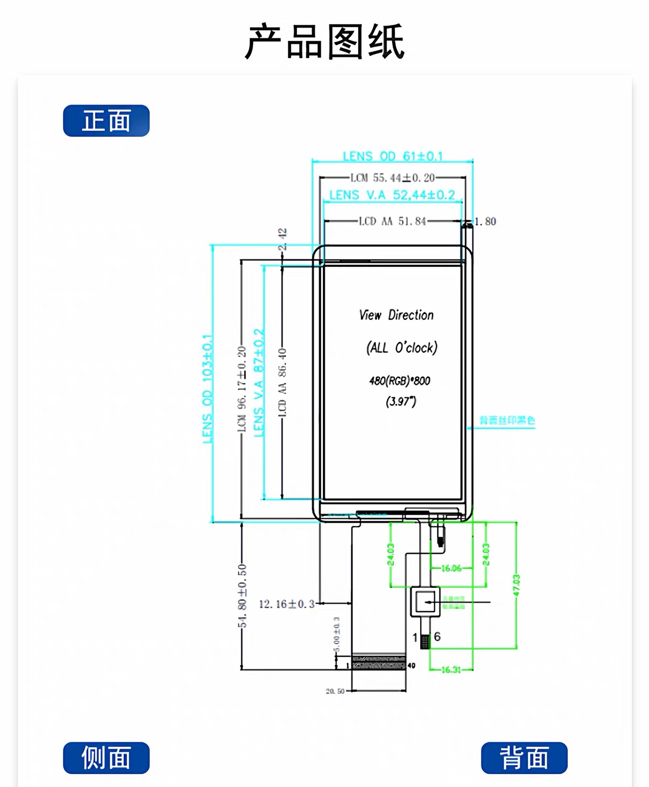
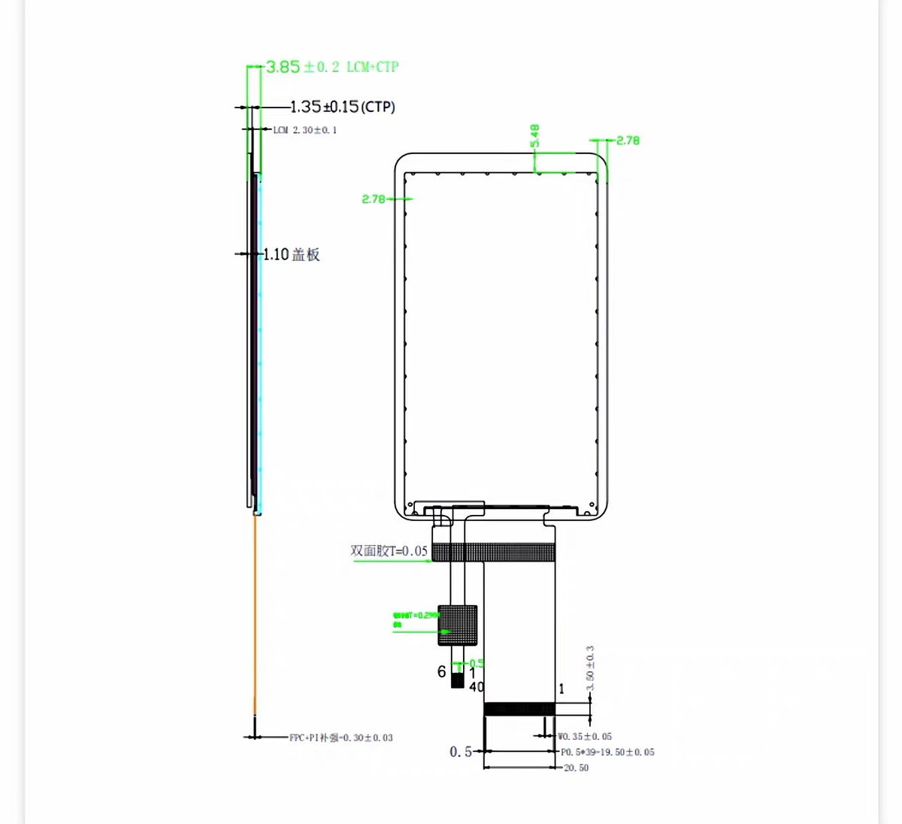

## display

### 基本信息

显示器采用浦洋 3.97 寸 IPS 显示屏，详细信息如下

| 信息     | 详情                        |
| -------- | --------------------------- |
| 产品型号 | P039BR009-V5-CTP            |
| 屏幕尺寸 | 3.97寸                      |
| 接口类型 | RGB24Bit                    |
| 分辨率   | 480xRGBx800                 |
| 外形尺寸 | 61(宽)x103(长)x3.9±0.2(厚) |
| 显示尺寸 | 51.84(宽)x86.4(长)          |
| 驱动IC   | ST7701S                     |
| 驱动电压 | 3.3V                        |
| 工作温度 | -20~70ºC                   |
| 储存温度 | -30~80ºC                   |

### 相关参数

