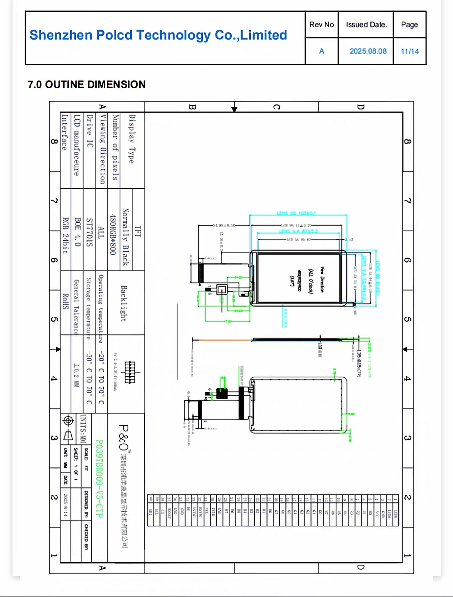
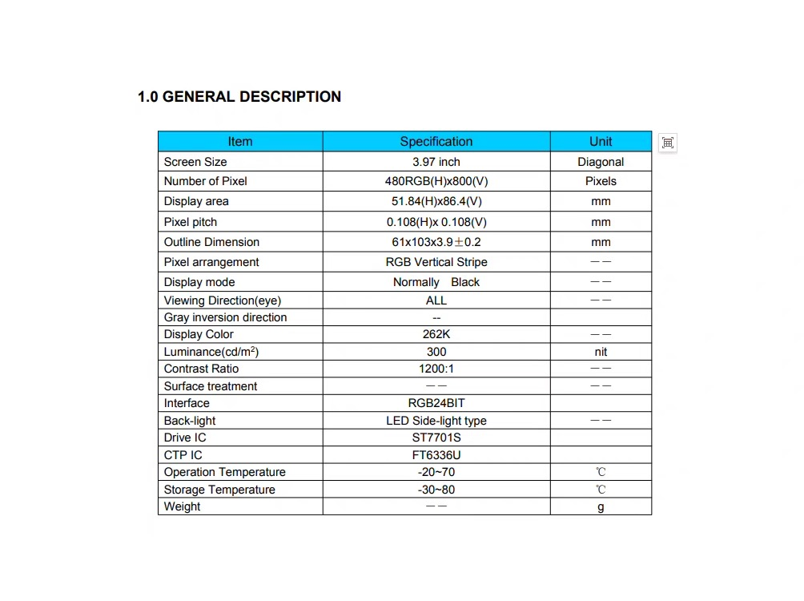
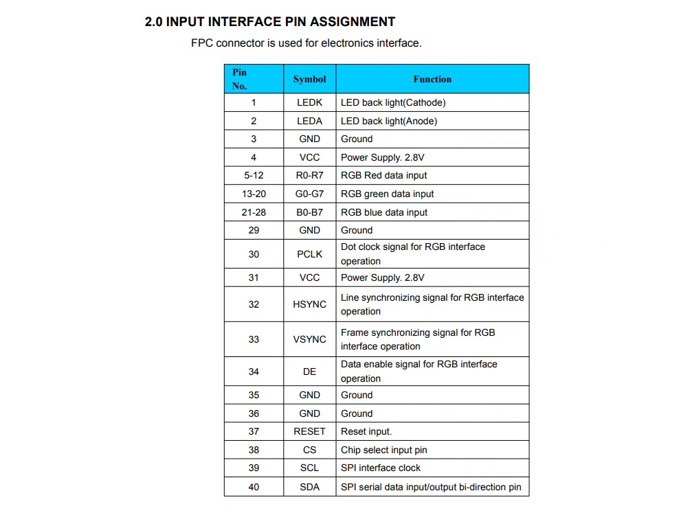
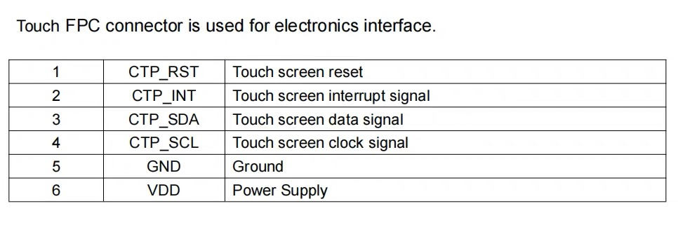

## 显示器

当前 lane 的数量待确定

### 产品型号

polcd P0397BR009-V5-CTP

### 屏幕尺寸

3.97 inch

### 接口类型

RGB24bit

### 分辨率

480 * RGB* 800

### 驱动 IC

ST7701S

### 驱动电压

3.3V

### 工作温度

-20~70°C

### 储存温度

-30~80°C

### 相关参数

